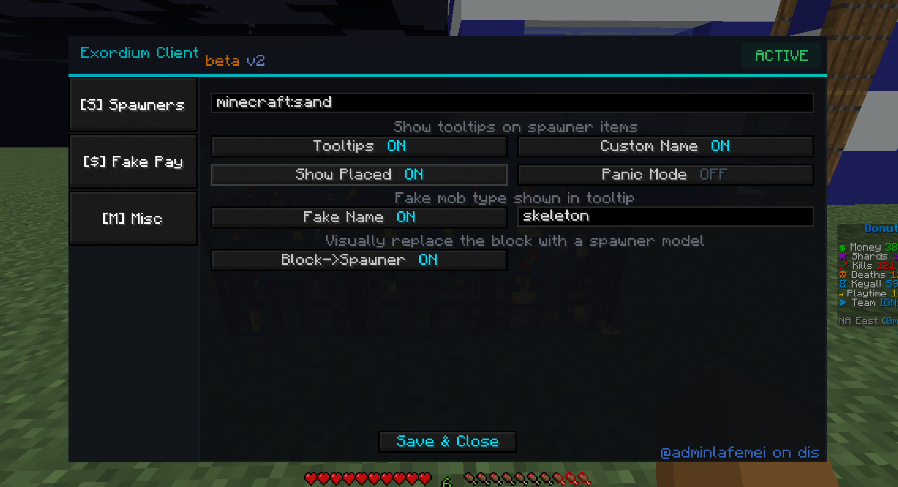
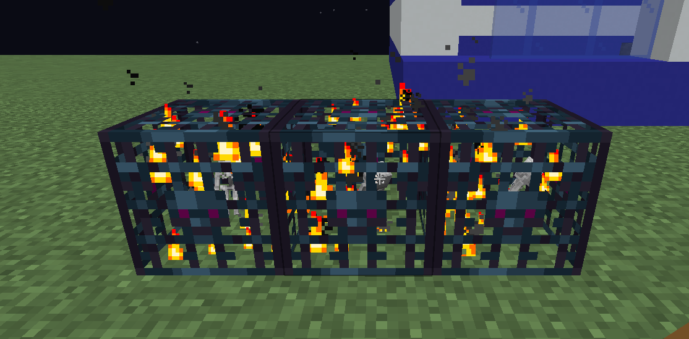
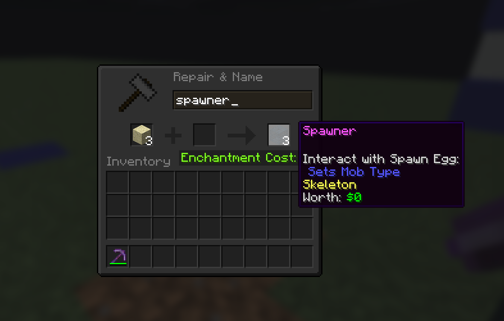
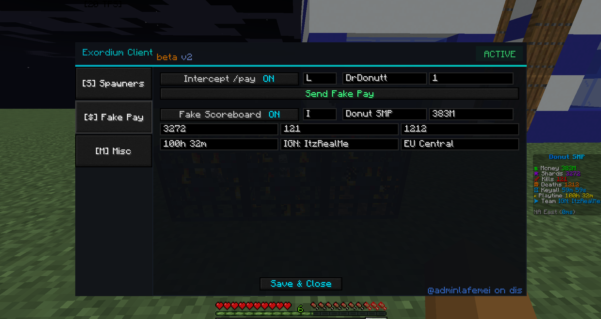
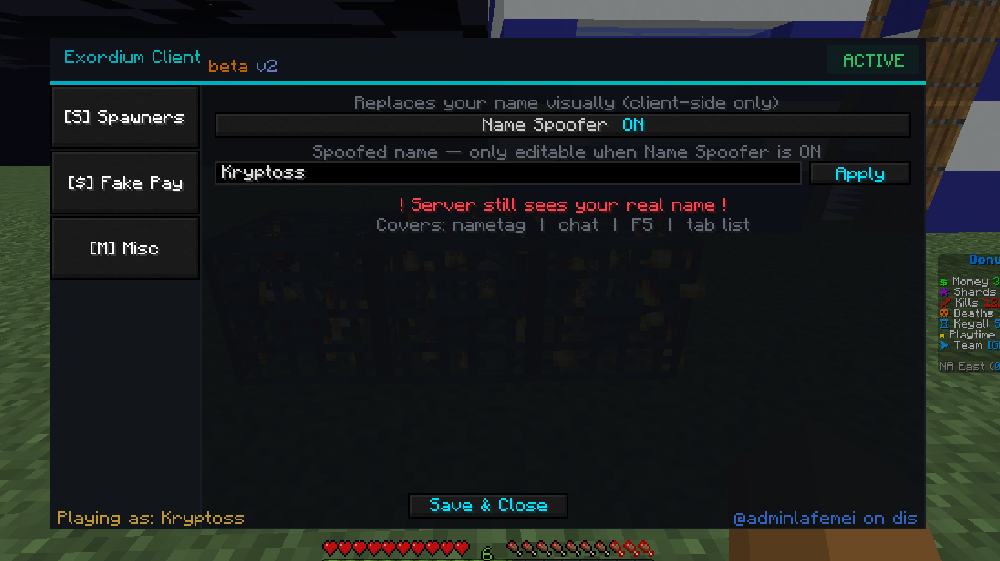

# Exordium Client

A Fabric client-side mod for Minecraft 1.21.1 with quality of life features for SMP servers.

> Made by **@adminlafemei** on Discord

---

## Preview

### Spawners Tab


### Fake Spawner Visuals


### Spawner Tooltip


### Fake Pay & Fake Scoreboard


### Scoreboard Preview


### Name Spoofer


---

## Features

### 🪄 Fake Spawner Visuals
Visually replaces any configured block with a spawner model client-side. The server never sees the change — only you do.
- Configure which block ID to treat as a spawner (e.g. `minecraft:sand`)
- Fake mob name shown in tooltip (e.g. Skeleton, Zombie)
- Tracks placed positions across sessions
- Entities spawned near fake spawners won't despawn

### 💰 Fake Pay
Intercepts your `/pay` commands and shows a fake payment message in chat instead of sending the real command.
- Toggle on/off with a keybind
- Set a custom recipient and amount in the GUI
- Deducts from your fake scoreboard balance
- Supports K, M, B, T suffixes (e.g. `500k`, `1.5M`)

### 📊 Fake Scoreboard
Replaces the server sidebar with a fully custom client-side scoreboard.
- Custom title, money, shards, kills, deaths, playtime, team
- Auto-detects your region based on coordinates
- Shows real ping
- Toggle on/off with a keybind

### 🎭 Name Spoofer
Replaces your own name visually on the client side.
- Covers: nametag, chat, F5 view, tab list
- Server still sees your real name

### 🚨 Panic Mode
Instantly hides all fake visuals with one keybind. Reverts fake spawners, hides fake scoreboard, disables all features.

---

## Installation

1. Install [Fabric Loader](https://fabricmc.net/use/) for Minecraft 1.21.1
2. Install [Fabric API](https://modrinth.com/mod/fabric-api)
3. Download `exordium-client-1.0.0.jar` from [Releases](../../releases)
4. Drop the JAR into your `.minecraft/mods/` folder
5. Launch Minecraft

---

## Usage

| Keybind | Default | Action |
|---------|---------|--------|
| Open GUI | `=` | Opens the Exordium Client settings screen |
| Panic Mode | Unbound | Toggles panic mode on/off |
| Fake Pay | `P` | Toggles fake pay on/off |

Open the GUI with `=` to configure all features.

---

## Requirements

- Minecraft 1.21.1
- Fabric Loader 0.16.9+
- Fabric API

---

## Building from Source

```bash
git clone https://github.com/pushykiller69-bot/exordium-client.git
cd exordium-client
gradlew.bat build
```

Output JAR will be in `releases/v1.0.0/`

---

## License

MIT License — free to use, modify and distribute.

---

*Discord: @adminlafemei*
